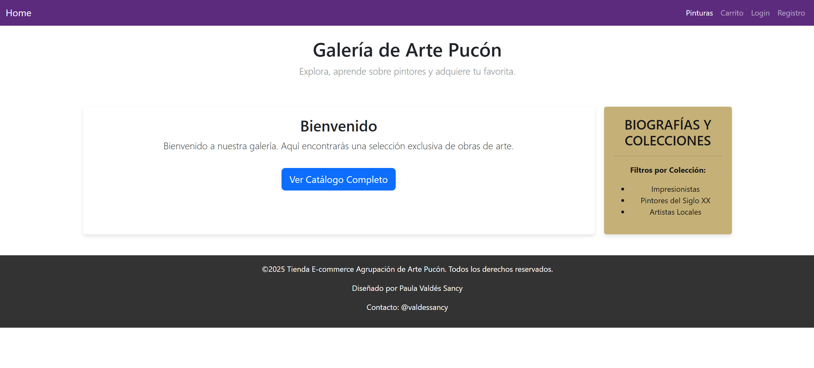
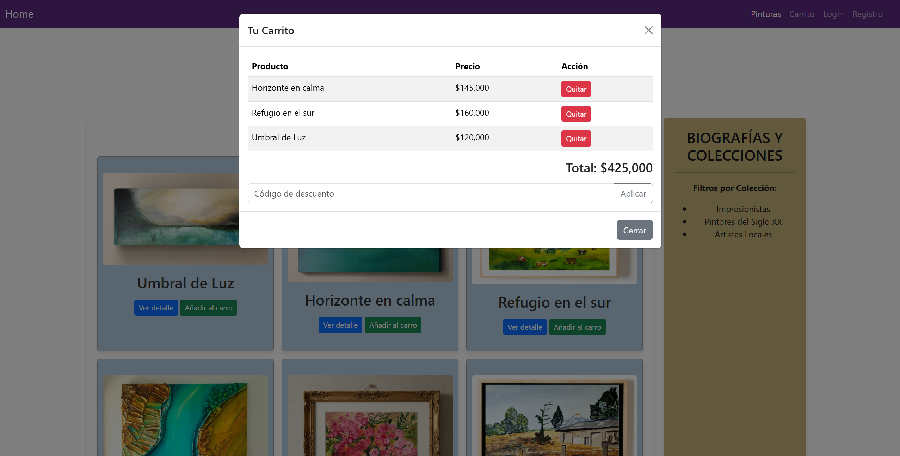
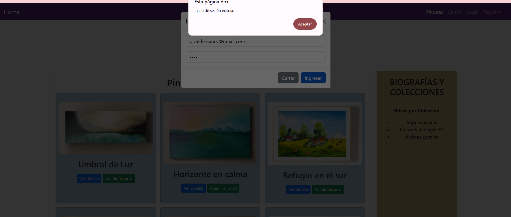

# M3 — E-Commerce: Carrito y Autenticación

## Descripción
Implementación de carrito (agregar/quitar, descuento opcional) y autenticación básica con Modal de Bootstrap.

## Tecnologías
- HTML5, CSS3, JavaScript
- Bootstrap 5 (CDN)

## Ejecutar
- Abrir `index.html` en el navegador (o usar Live Server).

## Funcionalidades
- Carrito (arreglo de productos)
- Descuento "DESC15"
- Modal de login (PASSWORD_MAESTRA)
- Render en tabla Bootstrap

## Capturas

### Vista Principal (Home)

### Carrito de Compras

### Modal de Inicio de Sesión

